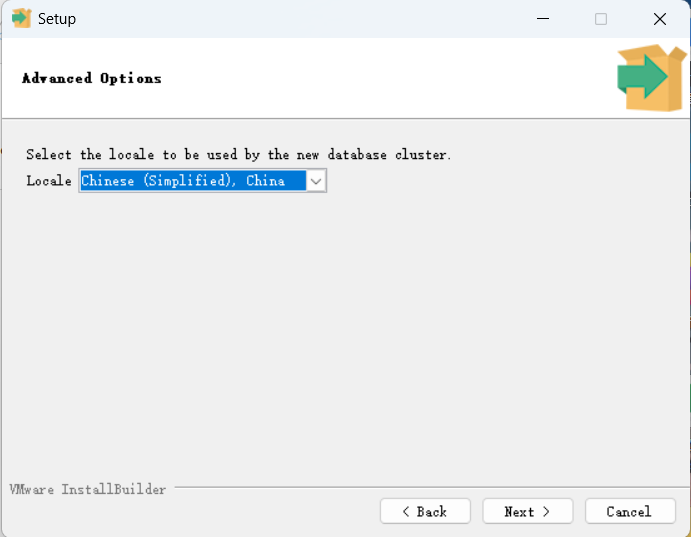
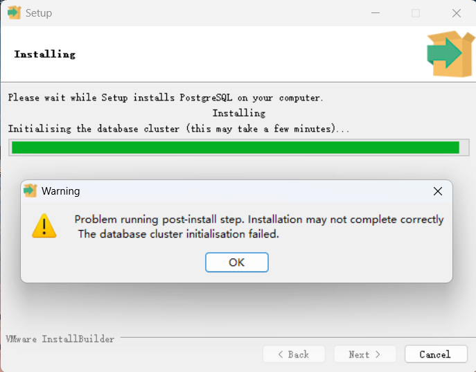

# PostgreSQL 安装及基本配置

#  Windows 下安装

## 下载安装程序

- [官网地址](https://www.postgresql.org/)

- [安装包地址](https://www.enterprisedb.com/downloads/postgres-postgresql-downloads)

可以下载最新版本，这里我为了和课程使用的版本保持一致，下载了 13.1.1 的版本。

但是 13.x 版本在安装时会出现一些问题，包括我后续安装 15.x 也有类似的问题。

最后不得已降版本，根据网上搜索的一篇博客，下载 12.x 版本可正常安装。

## 运行安装程序

安装时需要注意的一些选项

**选择 locale**

可以选择 [Default locale] 来使用系统默认，

也可以手动选择 Chinese (Simpefied), China。

不过选择上述选项后，安装时可能出现 databases initialisation failed 的情况。

所以为了避免麻烦也可选择 C。

然后除了修改保存路径，确保端口为 5432，剩余全部选择 next，然后 pgAmdin 4 等数据库工具会在安装时安装。

在安装程序的某一步骤，需要设置数据库的密码，设置一个自己常用能记住的密码即可。

## 安装后配置

可以选择将 postgreSQL 的 bin 目录添加至环境变量。

之后在 postgreSQL 的 pgAdmin 4/bin 目录 找到 pgAdmin4.exe 文件，
为其桌面创建快捷方式，后续操作 postgreSQL 数据主要使用该图形化工具。

## 常见问题

> **启动安装程序时出现报错并附有乱码**

**解决方案**

这种问题基本是由于电脑的中文用户名导致。

1. 按照网上教程把中文用户名修改为英文（不一定需要）

**参考链接**

- https://blog.csdn.net/JWsunshine/article/details/119885925

- https://blog.csdn.net/Porhowlyuu/article/details/127384201

2. win + r 键输入 netplwiz 打开该程序（修改用户账户信息）

选择用户并点击属性，然后修改用户名为之前设置的中文用户名。

然后重启电脑即可。

> **安装过程中出现数据库簇初始化错误，导致安装后 data 目录为空**

**参考链接**

- https://zhuanlan.zhihu.com/p/484450913

- https://blog.csdn.net/weixin_41501825/article/details/121259378

第一个链接的内容主要是使用 initdb.exe 程序手动初始化数据库，但是无论是 13.x 还是 15.x 都会出现 initdb.exe 和 postgres.exe 版本不一致的问题。

第二个链接里的内容是将降版本到 12.x，亲测 12.x 版本可以正常安装。

# linux 系统下安装

